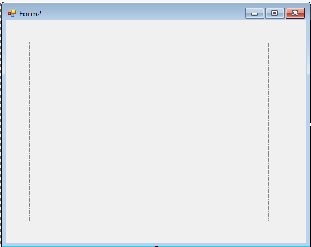
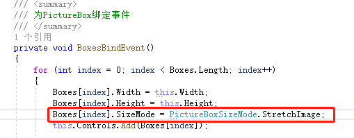

Winform实现长图显示控件，原理比较简单，会用到3个PictureBox控件，紧密排列，令其中的一部分显示到界面上，加上鼠标滑动事件，可以使得图片发生移动，判断达到某个条件的时候，将最左边或者最右边的PictureBox控件移动到新的位置，即可实现拖拽长图显示。

为达到更直观的效果，以下图为例，每个图片代表一个PictureBox，上面写的数字代表顺序，两条红线之间代表【**显示的区域**】，两条红线之外认为是不显示，黑线代表【判断移动的条件】，当黑线离开两条红线范围内的区域时，移动PictureBox，可以显示一张新的图片移动到移动方向的末尾。实现了资源的可重复利用。（思想上有点类似于Android的ListView组件[扩展链接](https://blog.csdn.net/cun_king/article/details/111243881)）


配合一个裁图的程序，可以实现拖拽长图的显示。（同样认为两条红线之间是显示的区域，那么这个区域是可以完整显示整个长图的）


正式使用示意图


为方便使用，我把功能封成了一个UserControl控件，直接调用即可，调用时需要在Form界面上放置一个Panel控件



调用示例：

```c
//传入的参数是Panel控件的宽和高
UCShowLongPicture longPicture = new UCShowLongPicture(MainPanel.Width, MainPanel.Height);
//参数1是图像在文件内的地址，参数2是显示出来的图像的宽度，参数3是显示出来的图像的高度
longPicture.SetImageParameter(@"C:\Users\admin\Pictures\Saved Pictures\test.jpg", 400, 300); 
//将UserControl控件显示到Panel控件上
MainPanel.Controls.Add(ShowLongPictureUtil);
```

至于为什么传一组Panel控件的宽和高，还要再传一组图像的宽和高？

--Panel控件的宽和高表示的是显示区域的大小；而图像的宽和高是裁图的依据，表示一次性显示多大的内容。

另外，根据自己的需求，修改UserControl里的PictureBox控件的显示方式，比如拉伸，或者是成比例显示等等。


